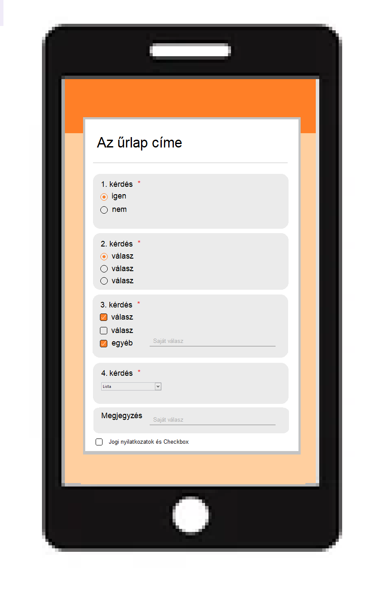

***1. Áttekintés*** 
Egy olyan weboldalt fejlesztünk, űrlapot készítünk, amellyel megtudhatjuk, hogy a debreceni lakosok milyen szempontok szerint választanak házon kívüli étkezési lehetőségek közül. Célunk, hogy az általunk feltett kérdésekre kapott válaszokból majd egy olyan étteremmel bővüljön a város, ami a lehető legnagyobb mértékben ki tudja elégíteni a fogyasztók igényeit. Kérdéseink elsősorban az étkezési körülményekre, a kínálatra, az étterem megfelelő felszereltségére irányulnak. Amennyiben azt a visszajelzést kapjuk a kitöltők részéről, hogy lenne igény jeles ünnepek, események tartására az étteremben (például esküvő, lakodalom, ballagási összejövetelek, szülinapi/névnapi ünneplések, diáktábori étkezések), úgy abban az esetben természetesen nem csak a helyszínt, hanem az étkeztetést is módunkban áll majd biztosítani vendégeink részére. Az igényeket igyekszünk a lehető legtöbb oldalról felmérni, így az űrlap kitöltésében résztvevőknek az általunk feltett kérdéseknél törekszünk minél több választási lehetőséget feltüntetni, ugyanakkor lehetőséget kínálunk további saját megjegyzés, ötlet hozzáfűzésére is. Az űrlap bárki számára hasznos és elérhető lesz online felületen. Természetesen nem csak számítógépen lesz elérhető, hanem célunk, hogy minél több platformon hozzá lehessen férni, legyen az tablet vagy telefon. Az elérhetőség/kitöltés ingyenes lesz, így bárki hozzáférhet a felméréshez, továbbá anonim jellegű.

***2. Jelenlegi helyzet*** 
A megrendelő fel szeretné mérni a fogyasztók igényeit, hogy versenytársaihoz képest így jusson piaci előnyökhöz. Egy weboldal előállítását rendelte meg, amely interneten keresztül modern megoldásokat használva működik. A modern világ megköveteli. hogy minden felületen is elérhető legyen, ennek megfelelően kell formázni az úrlapot is. Egy olyan weboldalra lenne szükség, amely könnyen eldönthető rövid kérdéseket, és jól átlátható válaszlehetőségeket is tartalmaz. Az adatokat egy adatbázisba fogjuk elmenteni, annak érdekében, hogy a későbbiekben ezekből az adatokból statisztikát is lehessen készíteni.

***3. Követelménylista*** 
|   Modul   | ID |         Név         | Kifejtés |
|-----------|----|---------------------|----------|
|Űrlap         | K1 |Kérdések (eldöntendő)|A felületen eldöntendő kérdéseket és igen/nem választási lehetőségeket kell megjeleníteni, amelyek opcióit választógombok segítségével lehessen kiválasztani. (Csak 1 válaszlehetőség.) A kérdéseket a megrendelő szolgáltatja.|
|Űrlap         | K2 |Kérdések (választó)  | Főként választó kérdések szerepeljenek. A csak egy válaszlehetőséggel bíró kérdéseket legördülőablakból vagy az előző pontban leírt választógombok segítségével lehet választani, míg a több választ is elfogadó kérdésekre a jelölőnégyzetekkel válaszolhat a felhasználó. A kérdéseket és válaszokat itt is szintén a megrendelő szolgáltatja.|
|Űrlap         | K3 |Kérdések (egyéb)|Ha a válaszadó nem találja meg a válaszlehetőségek közül a rá illőt, akkor az <b>egyéb</b> gombra kattintva és az ekkor megjelenő szövegmezőbe megírhatja egyedi válaszát.|
|Űrlap         | K4 |Megjegyzés           |A kérdőívre válaszolók egy szövegmezőben írhatják le véleményüket az űrlapról, esetleges felmerülő kérdéseiket, melyekre nem tértek ki a kérdések és egyéb ötleteket is megoszthatnak az étteremmel.|
|Jogi szabályok| K5 |Jogi nyilatkozatok   |Adatvédelmi nyilatkozat, GDPR, ASZF, szükség esetén Cookie szabályzat feltüntetése a weblapon.|
|Jogi szabályok| K6 |Checkbox             |Egy checkbox bepipálása nélkül nem küldheti el az űrlap adatait a felahasználó, ezért ennek hiányában szembetűnő értesítés jelenik meg a felületen.(javascript)|
|Felület       | K7 |Reszponzív felület   |Minden szabványos képernyőméret (monitor, tablet, telefon) esetén a weblap megfelelő módon nézzen ki.(html,css)|
|Felület       | K8 |Webböngésző támogatás|A legelterjedtebb webböngészőkön (Chrome, Firefox, Opera stb.) egyaránt igényes megejelnés és megfelelő működés elvárt.|
|Felület       | K9 |Űrlapok kinézete     |Lehetőség szerint az input mezők valamilyen könyvtár (pl. Bootstrap) használatával igényesen és modernül nézzenek ki.|

***4. Jelenlegi üzleti folyamatok modellje*** 
Manapság azok emberek, akik nagyvárosban élnek kevés szabadidővel rendelkeznek a felgyorsult életvitelük miatt, ezért szeretnek étterembe járni, mert  megspórpolják azt az időt, amit a főzéssel töltenének otthon. Ráadásul nagyvárosban sok rendezvényt tartanak (esküvő, ballagás, születésnapi buli stb...) amelynek az éttermek tudnak a legszínvonalasabb helyet nyűjtani. Debrecenben sajnos még nem alakult ki nagyméretű étteremlánc, amely el tudná látni a nagylétszámú lakossága igényeit. Kevés olyan étterem van a városban, amely elhozná az emberek számára más országok ételkülönlegességeit. Kevés étterem foglalkozik az extra igényű vendégekkel. (laktóz érzékenyek, glutén érzékenyek, vegánok stb...) Jelenleg étermünk, az <b>Apetit étteremlánc<b> képes ellátni ezeket a feladatokat.
  
***5. Igényelt üzleti folyamatok midellje*** 
Éttermünk, az Apetit étteremlánc nagy múltú cég, tehát jelentős tapasztalattal rendelkezik. Számos területen értünk el piacvezető pozíciót. Hatalmas választékkal bíró éttermünk képes kielégíteni a speciális igényű vendégek igényeit (vegetáriánusok, vegánok, glutén, szója, laktóz érzékenyek stb.) ugyanúgy, mint a hagyományos étrendet követők igényeit.
Kiváló séfjeink képesek elhozni más országok egzotikus ételkülönlegességeit. Nagyméretű éttermeink alkalmasak nagyszabású rendezvényekhez (esküvői lakodalmakhoz, ballagásokhoz konferenciákhoz stb...). 
  

***6. Használati esetek*** 
-FELHASZNÁLÓ: A Kérdőívhez belépve, jogosultsága van a mezők kitöltésére és válaszlehetőségek kiválasztására, valmint elküldésére. 
-ADMIN: Az ADMIN beléphet mindegyik más szerepkörbe,
hogy az hibamentes működését ellenőrizhesse. Az Admin
feladata a rendszer problémamentes működtetése. Ez egyben jár azzal,
hogy az egész rendszerhez van hozzáférése.

***5. Képernyő tervezete*** 
Az űrlap tervezete okostelefon képernyőn: 

