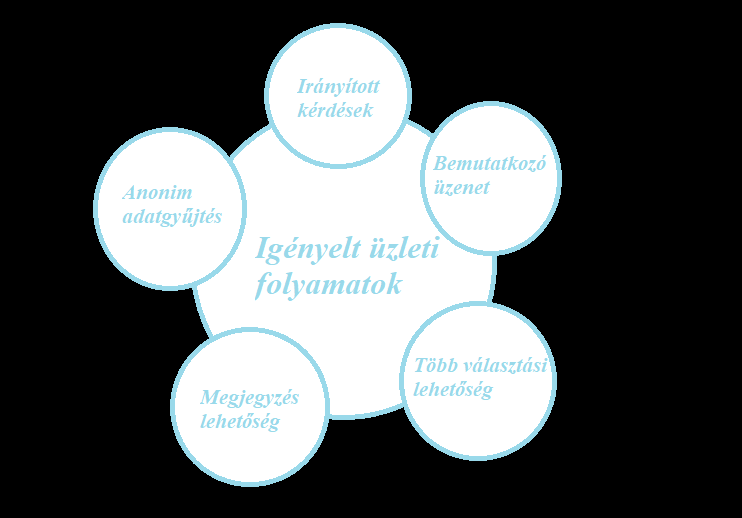

# Étterem igény követelményspecifikáció

***1. Áttekintés*** 
A weboldal célja igényfelmérést készíteni egy étteremnek. A weboldal az összes elterjedt webböngészőn (Firefox, Chrome, Edge, Opera) működjön megfelelően, illetve rendelkezik Web és Android felülettel, mindkettő módon, elérhető az összes felhasználói funkció. Az úrlap eldönthető rövid kérdéseket tartalmaz, amelyek felmérik a lakosok étkezési szokásait (ételérzéékenység, fogyasztási szokások, ételkülönlegességek, stb.). A későbbi felhasználás miatt, a bekért adatokat egy adatbázisban tároljuk.

***2. Jelenlegi helyzet*** 
- Az **Apetit étteremlánc** Magyarországon eddig 23 városban van jelen és szeretnénk éttermet nyitni Debrecenben is.
- Ehhez a cég szeretne igényfelmérést készíteni egy online űrlapon keresztül.
- Szeretnénk felmérni a debreceni lakosok étkezési szokásait:
    - milyen gyakran étkeznek házon kívül
    - milyen preferenciák alapján választanak éttermet (étterem közelsége, ételek változatossága, ételek egzotikussága, barátok javaslatára stb...).

***3. Vágyálom rendszer*** 
- Az eredményes adatszerzés érdekében szükség van könnyen eldönthető rövid kérdésekre, és jól átlátható válaszlehetőségekre.
- Ezen felül szükséges egy adatbázis, amely eltárolja a lakosoktól bekért adatokat, és ezekből az adatokból statisztikát is lehessen készíteni.
- Elvárás hogy az űrlap platformfüggetlen legyen. Az online megjenés lehetőleg mobil telefonon, tableten is működjön, reszponzív felülettel.

***4. A rendszerre vonatkozó szabályok*** 
- A webfelület szabványos eszközökkel készüljön, html/css/javascript.
- A jogszabályoknak megfelelően az adatvédelmi tájékoztó legyen megjelenítve a weboldalon.
- Cookie-k használata esetén a cookie szabályzat megjelenítése is kötelező.
- A weboldal az összes elterjedt webböngészőn (Firefox, Chrome, Edge, Opera) igényesen nézzen ki és működjön megfelelően.
- Elavult (deprecated) technológiákat kérjük ne használjanak, az időtállóság miatt
- A weboldal legyen modern, de egyszerű, az űrlapoknál fontos a feedback, hogy a felhasználó kijelölte az adott form-ot stb.
- A képek nagy felbontásúak legyenek, vízjel nélkül és png vagy jpg formátumúak
- A projektet ajánljuk valamilyen verziókezelő rendszer segítségével elkészíteni, a visszakövethetőség és az egyszerűbb csoportmunka miatt

***5. Jelenlegi üzleti folyamatok*** 
- 4.1. Étkezési szokásokra vonatkozó kérdések
- 4.1.1. A házon kívüli étkezések gyakoriságának felmérése (naponta, hetente, havonta, évente,...)
- 4.1.2. Milyen okokból étkeznek házon kívül (időmegtakarítás, társaság, nagyobb kínálat, jeles alkalmak megünneplése, gazdasági szempontok, ismerettség, kedvezmény, kényelem)
- 4.2. Étkezdék tulajdonságaira vonatkozó kérdések
- 4.2.1. Mely étkezdéket részesítenek előnyben (étterem, menza, kifőzde, gyorsétterem, élelmiszerbolt, bevásárlóközpontok étkező részlege)
- 4.2.2. Mik a főbb szempontok, preferenciák egy étkezde kiválasztásában (közelség, ételek minősége, ár, kiszolgálás, népszerűség, megbízhatóság, ételek változatossága, ételérzékenység, környezettudatosság)
- 4.3. A kínálatra vonatkozó kérdések
- 4.3.1. A legkedveltebb ételkülönlegességek felmérése (magyaros ízek, más országok, régiók fogásai, a séf ajánlata, gyermek menük)
- 4.3.2. Ételérzékenység figyelembe vétele (glutén-, laktózérzékenység, cukorbetegség, vegetáriánus, illetve vegán életmód)
- 4.4. Fogyasztási szokások: Elvitelre/az étteremben/házhozszállítással
- 4.5. Az étterem felszereltsége (etetőszék, légkondícionáló berendezés, svédasztal, önkiszolgáló ételrendelés, mosdólehetőség, drive kiszolgálás, bankártyás fizetés, parkolási lehetőség)
- 4.6. Kedvezmények, árajánlatok fontosságának felmérése (korlátlan üdítőfogyasztás, ajándék kiegészítők egyes menük választása esetén, kuponfüzet, nyereményjáték)

***6. Igényelt üzleti folyamatok*** 
- 6.1 Az űrlapot kitöltő egy olyan weboldalon akar válaszolni a kérdésekre, ahol a kérdések számozva jelennek meg, majd alattuk egy legördülő menüből választhat a megadott válaszlehetőségek közül.
- 6.2. A kitöltés megkezdése előtt egy üdvözlő, bemutatkozó szöveg köszöntené a válaszadót, amelyben ismertetjük az űrlap elkészítésének okát.
- 6.3. Amennyiben a kitöltő egy adott kérdésre 1-nél többet is kiválaszthat, arról tájékoztatást kap közvetlenül a kérdés után zárójelek között(válasszon ki egyet vagy többet).
- 6.4. Abban az esetben, ha saját ötletet akarna hozzáírni a megadott opciókon felül, szerepelni fog minden kérdésblokkban egy szövegdoboz is, ahol begépelhet véges számú karaktersorozatot.
- 6.5. A kitöltést követően egy köszönetnyilvánítási oldal fogadná a kitöltőt, melyben megköszönjük a kitöltést, illetve megadjuk további kérdés, javaslat írás igénye esetén elérhetőségünket.

***7. Riportok*** 
Kérdőív irányított riporthoz.
Interjú kérdések az elektronikus webfelület (űrlap) követelményspecifikációjának felállításához. Kérjük, lehető legjobb tudása szerint töltse ki. A kérdezőbiztos nem válaszolhat kérdéseire, hogy ne befolyásolja Önt.
- Mit gondol, egy megfelelően megválasztott kérdéseket tartalmazó űrlap kellőképpen fel tudja mérni a fogyasztói igényeket?
- Milyen előnyöket nyújt Ön szerint, ha az emberek főzés helyett inkább éttermi ételeket fogyasztanak?
- Milyen adatkezelési, biztonsági szintet kell kielégítenie Ön szerint egy elektronikus űrlapkitöltési felületnek?
- Milyen fő funkciókat vár el egy ilyen felülettől?
- Kérem írja körül, hogy Önöknél milyen webes funkciók az előírtak, preferáltak! Milyen nehézségek merültek fel a kivitelezésben?
- Kérem, soroljon előnyöket/hátrányokat az elektronikus illetve papíralapú igenyfelmérések relációjában!
- Az elektronikus űrlap esetén milyen szintű online megjelenést vár el a szerkesztőktől? Legyen a feleletkiválasztásos módon kívül válaszkifejtési lehetőség, esetleg pontozási sávok, ahol a kitöltők egy skálán tudnák rögzíteni folytonos értékekkel a válaszukat?
- Mit gondol, mely böngésző a leggyakrabban használt egy átlag ember esetén?
- Milyen kinézet, stílus a legkézenfekvőbb egy űrlap hatékony, gyors, egyszerű kitöltésére? Kérem, adjon képernyő terveket!
- Milyen tapasztalatai vannak az online űrlap készítés, kitörést illetően?
- Ön szerint hatékonynak bizonyul az online formában történő igények felmérése?
- Fizetne Ön egy jól megszerkesztett weboldalon elérhető űrlap kitöltő felületért?

***8. Követelménylista*** 
A kérdőívben megjelenő funkciók táblázatba foglalása és al-funkciók leírása.

|   Modul   | ID |         Név         | Kifejtés |
|-----------|----|---------------------|----------|
|Űrlap         | K1 |Kérdések (eldöntendő)|Az eldöntendő kérdésekre a választógombok segítségével, igen/nem válaszlehetőséggel lehet válaszolni.|
|Űrlap         | K2 |Kérdések (választó)  |A csak egy válaszlehetőséggel bíró kérdéseket legördülőablakból vagy az előző pontban leírt választógombok segítségével lehet választani, míg a több választ is elfogadó kérdésekre a jelölőnégyzetekkel válaszolhat a felhasználó.|
|Űrlap         | K3 |Kérdések (egyéb)|Ha a válaszadó nem találja meg a válaszlehetőségek közül a rá illőt, akkor az <b>egyéb</b> gombra kattintva és az ekkor megjelenő szövegmezőbe megírhatja egyedi válaszát.|
|Űrlap         | K4 |Megjegyzés           |A kérdőívre válaszolók egy szövegmezőben írhatják le véleményüket az űrlapról, esetleges felmerülő kérdéseiket, melyekre nem tértek ki a kérdések és egyéb ötleteket is megoszthatnak az étteremmel.|
|Jogi szabályok| K5 |Jogi nyilatkozatok   |Adatvédelmi nyilatkozat, GDPR, ASZF, szükség esetén Cookie szabályzat feltüntetése a weblapon.|
|Jogi szabályok| K6 |Checkbox             |Egy checkbox bepipálása nélkül nem küldheti el az űrlap adatait a felahasználó, ezért ennek hiányában szembetűnő értesítés jelenik meg a felületen.|
|Felület       | K7 |Reszponzív felület   |Minden szabványos képernyőméret (monitor, tablet, telefon) esetén a weblap megfelelő módon nézzen ki.|
|Felület       | K8 |Webböngésző támogatás|A legelterjedtebb webböngészőkön (Chrome, Firefox, Opera stb.) egyaránt igényes megejelnés és megfelelő működés elvárt.|
|Felület       | K9 |Űrlapok kinézete     |Lehetőség szerint az input mezők valamilyen könyvtár (pl. Bootstrap) használatával igényesen és modernül nézzenek ki|
